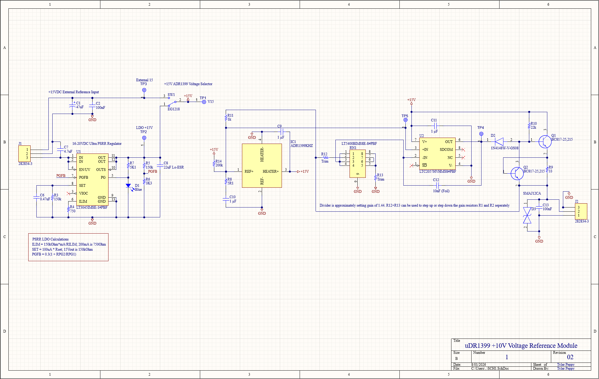
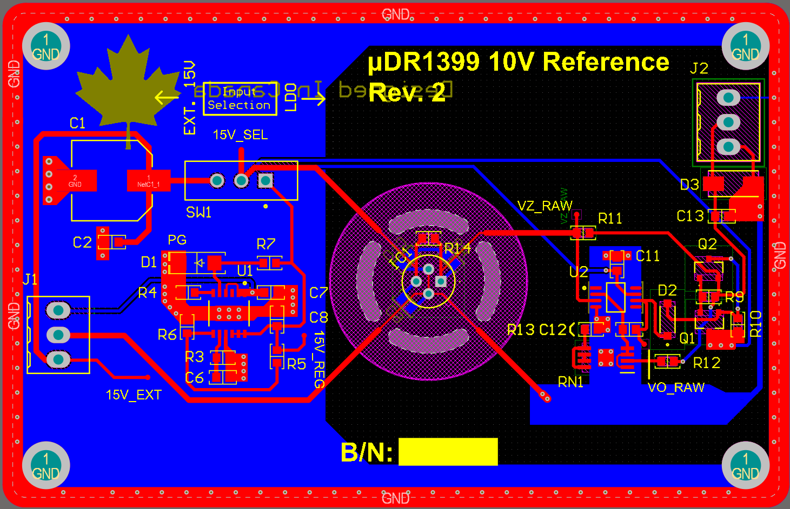
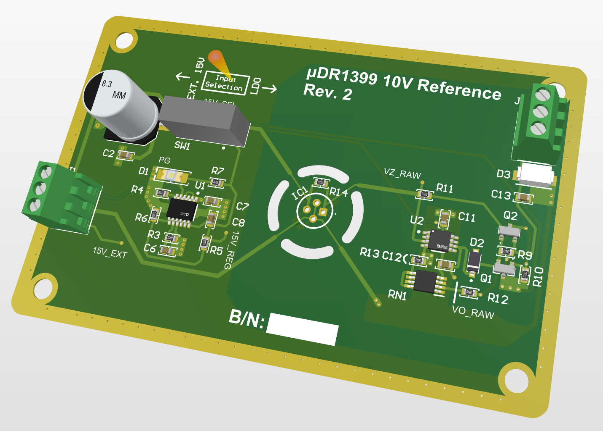
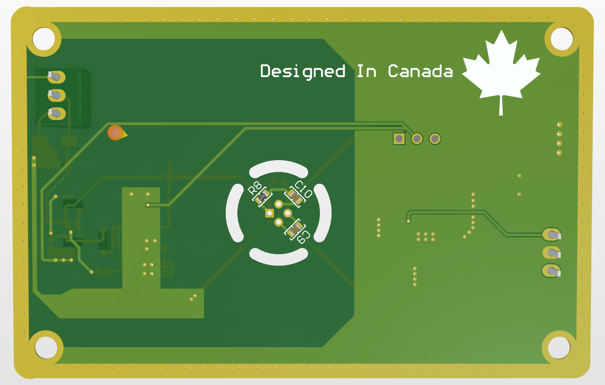
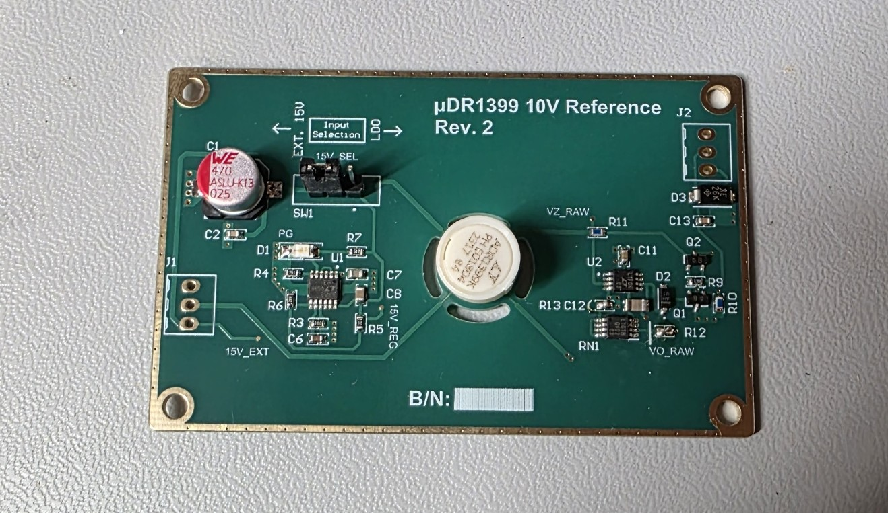
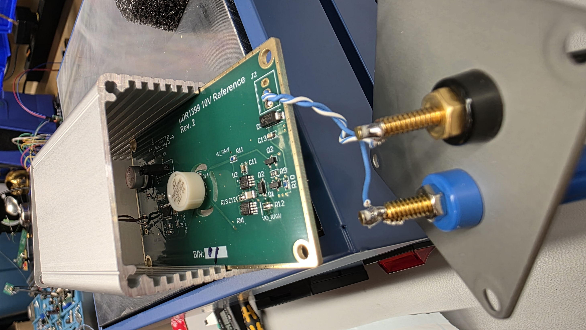

# uDR1399-10V-Reference-Standard

Pronounciation: Mew-Dee-Arr-thirteen-ninety-nine. 

The second revision of the ADR1399 portable bench standard for stable voltage outputs. 

# **Background:**

After the previous version of my ADR1399 standard, the stability left something to be desired. As a result, this version incorporates bootstrapping, an output transistor, and adjustable current limiting. Furthermore, additional ESD protection has been added to the output. The output now incorporates an LT5400 resistor network for gain setting, and as such, is expected to be very stable for the precision gain stage. Two resistors can be used to increase or decrease the gain; although I was not fully after +10.00000V, and wished to have a stable reference first.

Trimming will always be required, as all ADR1399 samples I have recieved in recent times are not close to 7.05V, and usually 6.90V or 6.93V. Care must be taken to use as low temperature coeffecient resistors as possible for trimming, as they introduce extra instabilities to the gain stage.

# **Design:**

## **Schematic**

## **Board Layout**

### **2D Board Multilayer:**

### **3D Board Renderings**

# **Design Notes:**
## **1 - Power Supply:**
Much has stayed from the previous design's power supply (See: [uDR1399 Rev01](https://github.com/T-622/ADR1399-10V-Bench-Standard/tree/main)). The LT3045 is a very good regulator when used properly. One issue I encountered often with the design is that hotplugging power supplies at ~18V with the L, C, and R of the power cables can cause transients large enough to exceed the absolute +22V maximum for the LT3045's inputs. This issue can be resolved through a soft-start circuit using an RC circuit to charge the gate of a p-channel FET, or an appropriate TVS diode. I have not placed these in the design, as my power supply ramps without ringing, and 2x 9V batteries seem to work reasonably well. 

The board's manual power mux is located in the top left corner, and can select from an external 15V regulated supply, or an unregulated 16-20V input fed to the LDO. Optionally, you can use an SPDT switch to externally control the mux. The PG indicator will light up whenever the +15V output is ready from the LDO, regardless if it is being used or not.

## **2 - Island Redesign**
The isolation island was redesigned to use 4 points of contact rather than the previous single tongue design. The previous design would droop under very low force, and cause odd voltage drops. The traces now neck down from 20mil to 10mil to reduce the thermal mass coming out of the island.

## **3 - Gain Stage**
The gain stage was redesigned to use the bootstrapped Zener scheme. As a result, the 3mA zener current will be much more stable against supply fluctuations. Lots of examples are available on the EEVBlog forums using this scheme. An additional 200kOhm resistor was used to assist with startup current for the reference as well. It doesn't seem to cause a different output behavior stuffed or not. It may be left off.

Additionally, the non-inverting amplifier gain resistors are now set by an LT5400 resistor network. The match on these for the B grade parts is 0.025%, with a 0.2ppm/c matching coeffecient. These are configured in a 2K + 4.5K stage, for a gain of 1.44v/v. Two additional trim resistors may be used if required.

## **4 - Output**
I added an ESD diode to the output to prevent damage through mishandling. The output consists of a transistor and a current limit. Currently the 33 ohm set resistor provides a maximum of 10mA. The output features the ~10V output, and the chassis ground, and the sense ground. Either can be chosen for experimentation purposes.

# **Assembly:**
Boards were ordered from JLCPCB using the ENIG-RoHS finish for better board flatness, minimising component lead stresses. A solder stencil was also added for more repeatability while assembling the boards, and better temperature control compared to using an iron. 

Assembly was done with ChipQuik [SMD291AXT4-T4 Leaded Solder Paste](https://www.digikey.ca/en/products/detail/chip-quik-inc/SMD291AXT4/8543521) and using a cheap hotplate at 235 degrees C. Note that these boards are NOT certified as lead free for obvious reasons. Leaded solder has a lower melting point, and is signficantly better for component stresses according to numerous voltnuts. Bismuth solder paste could be used, but it provides very little mechanical strength.

The case uses a Hammond Manufacturing 1455CS801 80mmx54mm case with internally ribbed board supports. This is the most simple solution for most users, and uses the top and bottom layer edge plating to ground the enclosure, without directly attaching it to the output sense ground. For binding posts, the output terminals should be assembled with solid copper twisted pair ethernet cable (Cabling can be found for cheap or out of many cables), coupled with Pomona 3770 gold-plated tellurium copper posts.

For output sensing, it is helpful to use 19.05mm spaced posts, as they will fit BNC-Banana for shielded sense leads. The input connectors do not require such posts, and can be used freely.

# **Stability Testing**

Before powering ON, PLEASE READ Design Note 1 - Power supply. This will help understanding potential input voltage damage risks associated with connections.

Stability testing was conducted after 72H on unit 1 of 3. The following results were obtained by my Keithley DMM6500 6-1/2 digit multimeter:

Using 10NPLC, 10 sample Repeating filter, 10GOhm InZ, AZ On, test controller works well to collect large amounts of stability data. I will update with temeperature data once I get a chance. The DMM6500 is relatively noisy, thus the STD-Dev is calculated over 1799 samples for averaging. 3.33uV STD-Dev is signficantly better than the Rev01 board, which obtained only about 8uV. 

